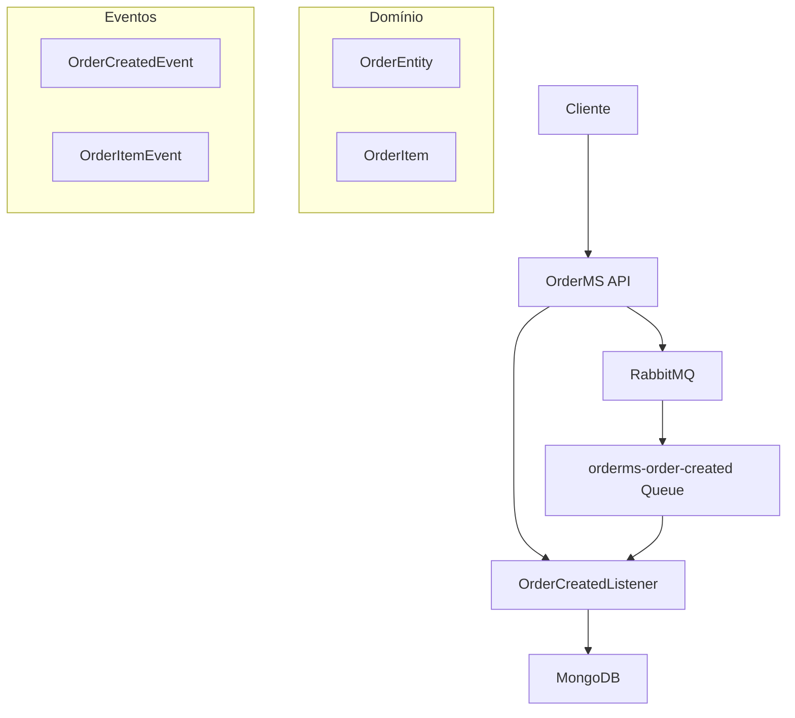
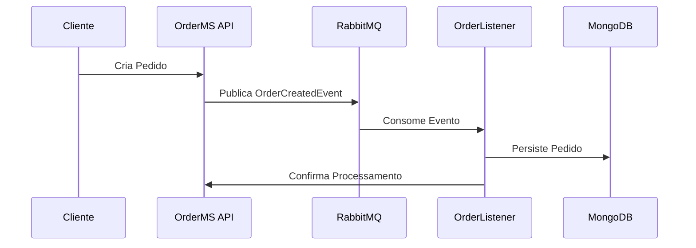

# 🛒 OrderMS - Microserviço de Pedidos


## 📋 Sobre o Projeto

**OrderMS** é um microserviço especializado no **processamento e gerenciamento de pedidos** em uma arquitetura distribuída. O serviço implementa padrões modernos de desenvolvimento, incluindo **Event-Driven Architecture** e **Domain-Driven Design**.

### 🎯 Características Principais

- 🏗️ **Arquitetura Orientada a Eventos** - Processamento assíncrono via RabbitMQ
- 📦 **Persistência NoSQL** - MongoDB para armazenamento escalável
- 🔄 **Event Sourcing** - Rastreamento completo do ciclo de vida dos pedidos
- 🚀 **Cloud Ready** - Containerização com Docker
- 🧪 **Testes Automatizados** - Cobertura completa com JUnit e Bruno
- 📊 **Monitoramento** - Logs estruturados e métricas

---

## 🏛️ Arquitetura



### 📦 Componentes

| Componente | Responsabilidade |
|-----------|-----------------|
| **OrderEntity** | Agregado principal representando um pedido |
| **OrderItem** | Value Object para itens do pedido |
| **OrderCreatedListener** | Event Handler para eventos de criação |
| **RabbitMqConfig** | Configuração de mensageria e filas |

---

## 🚀 Quick Start

### Pré-requisitos

- ☕ **Java 21+**
- 🐳 **Docker & Docker Compose**
- 📦 **Maven 3.8+** (ou usar o wrapper incluído)

### 1️⃣ Clone o Repositório

```bash
git clone <repository-url>
cd orderms
```

### 2️⃣ Inicie a Infraestrutura

```bash
# Sobe MongoDB e RabbitMQ via Docker
cd docker
docker-compose up -d
```

### 3️⃣ Execute a Aplicação

```bash
# Usando Maven Wrapper (recomendado)
./mvnw spring-boot:run

# Ou usando Maven local
mvn spring-boot:run
```

### ✅ Verificação

- 🌐 **Aplicação**: http://localhost:8080
- 🐰 **RabbitMQ Management**: http://localhost:15672 (guest/guest)
- 🍃 **MongoDB**: localhost:27017

---

## 🔧 Configuração

### MongoDB

```yaml
# application.properties
spring.data.mongodb.host=localhost
spring.data.mongodb.port=27017
spring.data.mongodb.database=orderdb
spring.data.mongodb.username=admin
spring.data.mongodb.password=admin123
```

### RabbitMQ

| Fila | Propósito |
|------|-----------|
| `orderms-order-created` | Eventos de criação de pedidos |

---

## 📡 API & Eventos

### 🔔 Eventos Consumidos

#### OrderCreatedEvent
```json
{
  "codigoPedido": 12345,
  "codigoCliente": 67890,
  "itens": [
    {
      "produto": "Notebook Dell",
      "quantidade": 1,
      "preco": 2500.00
    }
  ]
}
```

### 📊 Modelo de Dados

#### OrderEntity
```java
@Document(collection = "orders")
public class OrderEntity {
    private String id;
    private Long codigoPedido;
    private Long codigoCliente;
    private List<OrderItem> itens;
    private BigDecimal total;
    private LocalDateTime createdAt;
}
```

---

## 🧪 Testes

### Executar Testes Unitários
```bash
./mvnw test
```

### Testes de API (Bruno)
```bash
# Instale o Bruno CLI
npm install -g @usebruno/cli

# Execute os testes de API
cd orderms
bru run
```

---

## 🐳 Docker

### Desenvolvimento Local
```bash
# Infraestrutura completa
docker-compose -f docker/docker-compose.yml up -d
```

### Build da Aplicação
```bash
# Criar imagem Docker (exemplo)
docker build -t orderms:latest .
```

---

## 📁 Estrutura do Projeto

```
orderms/
├── 📁 src/main/java/tech/tech3br/orderms/
│   ├── 📁 config/           # Configurações (RabbitMQ, etc.)
│   ├── 📁 entity/           # Entidades de domínio
│   ├── 📁 listener/         # Event Handlers
│   │   └── 📁 dto/          # DTOs de eventos
│   └── 📄 OrdermsApplication.java
├── 📁 src/main/resources/
│   └── 📄 application.properties
├── 📁 docker/
│   └── 📄 docker-compose.yml
├── 📁 orderms/              # Testes Bruno
└── 📄 pom.xml
```

---

## 🔄 Fluxo de Eventos



---

## 🛠️ Stack Tecnológica

### Backend
- **Spring Boot 3.5.3** - Framework principal
- **Spring AMQP** - Integração RabbitMQ
- **Spring Data MongoDB** - Persistência NoSQL
- **Jackson** - Serialização JSON

### Infraestrutura
- **MongoDB** - Banco de dados NoSQL
- **RabbitMQ** - Message Broker
- **Docker** - Containerização

### Testes
- **JUnit 5** - Testes unitários
- **Bruno** - Testes de API
- **Spring Boot Test** - Testes de integração

---

## 📊 Monitoramento & Logs

### Logs Estruturados
```java
// Exemplo de log no OrderCreatedListener
logger.info("Message consumed: {}", message);
```

### Health Checks
- ✅ MongoDB Connection
- ✅ RabbitMQ Connection
- ✅ Application Status

---

## 🤝 Contribuição

1. 🍴 Fork o projeto
2. 🌿 Crie uma feature branch (`git checkout -b feature/AmazingFeature`)
3. ✅ Commit suas mudanças (`git commit -m 'Add some AmazingFeature'`)
4. 📤 Push para a branch (`git push origin feature/AmazingFeature`)
5. 🔄 Abra um Pull Request

### 📋 Padrões de Commit

- `feat:` nova funcionalidade
- `fix:` correção de bug
- `docs:` documentação
- `style:` formatação
- `refactor:` refatoração
- `test:` testes
- `chore:` manutenção

---

## 📄 Licença

Este projeto está sob a licença [MIT](LICENSE).

---

## 👥 Time

Desenvolvido com ❤️ pela equipe **Tech3BR**

---

## 📞 Suporte

- 🐛 **Issues**: [GitHub Issues](../../issues)
- 📧 **Email**: dev@tech3br.com
- 📖 **Wiki**: [Documentação Completa](../../wiki)

---

*🚀 Pronto para escalar seus pedidos? Clone, configure e execute!*
